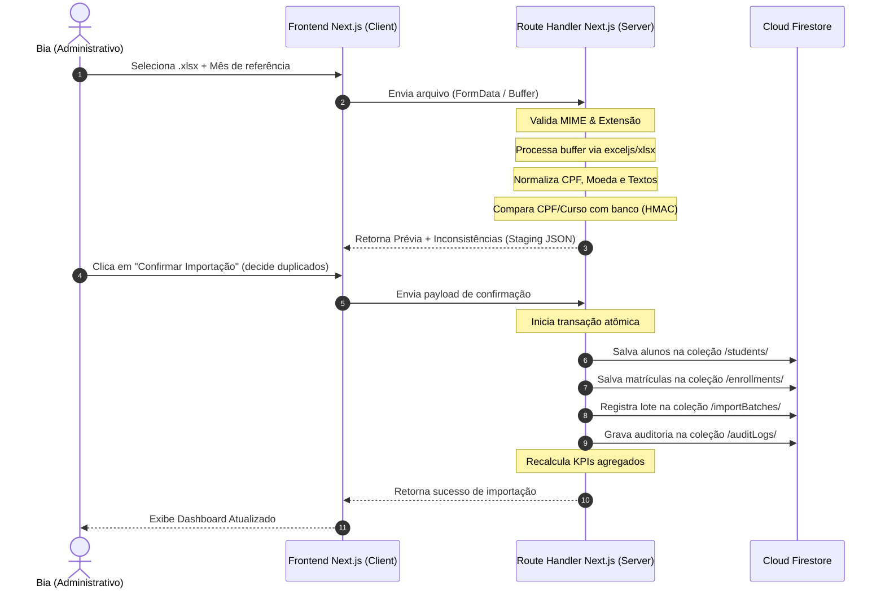
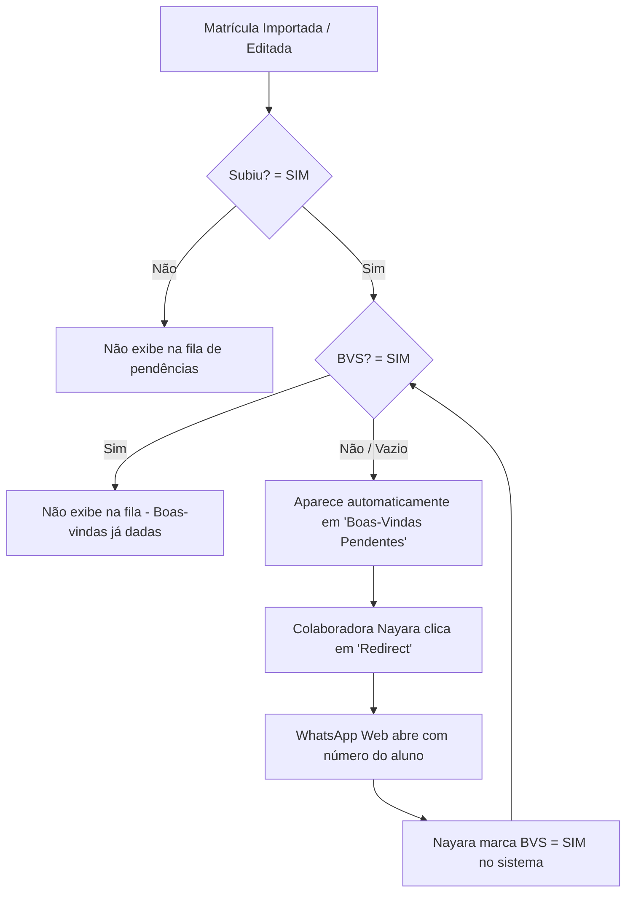

# Visão Geral da Arquitetura do Sistema — CIES Gestão

Este documento apresenta a arquitetura macro, o fluxo de dados e os papéis técnicos no sistema CIES Gestão.

---

## 1. Fluxo de Dados da Importação de Planilhas

A importação é efêmera e atômica, passando pelas seguintes camadas técnicas:

---

## 2. Fluxo da Regra Automática de Boas-Vindas

O Relacionamento acompanha o gargalo de atendimento de pós-venda utilizando o status derivado:

---

## 3. Estrutura Modular da Aplicação
- **`src/app/`**: Roteamento físico (App Router). Contém as layouts, páginas de login e dashboard e endpoints de API.
- **`src/features/`**: Divisão lógica por recursos. Cada feature possui seus componentes específicos, hooks e queries para não misturar domínios de negócio.
- **`src/lib/`**: Utilitários puros reutilizáveis e integradores de SDKs (Firebase client, Firebase admin, formatação financeira, datas e criptografia HMAC de CPF).
- **`src/server/`**: Lógica que roda exclusivamente no servidor, incluindo repositórios de acesso ao Firestore, Server Actions e middleware de autorização de sessão.
